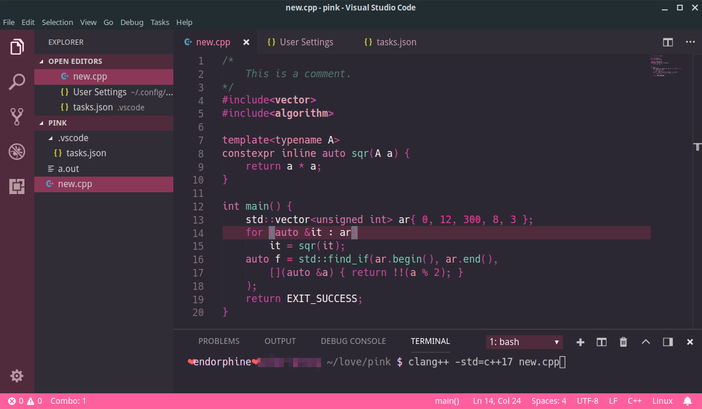
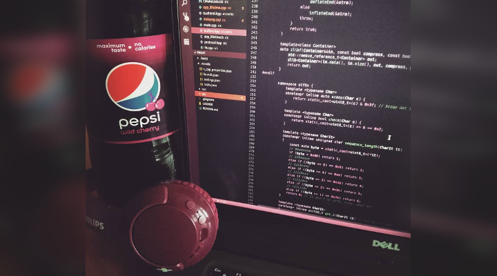

## Roseate VS Code theme

A dark theme which utilizes shades of pink and a tiny bit of spring green.  
Aimed to make my C++ code prettier; or, really, just so it goes well with all the *wild cherry* Pepsi that's seemingly always there next to my computer.

---

Licensed under WTFPL  

> Copyleft (&#8580;) 2018 Emilia "Endorfina" Majewska  
> All wrongs reserved. Have fun with it.

